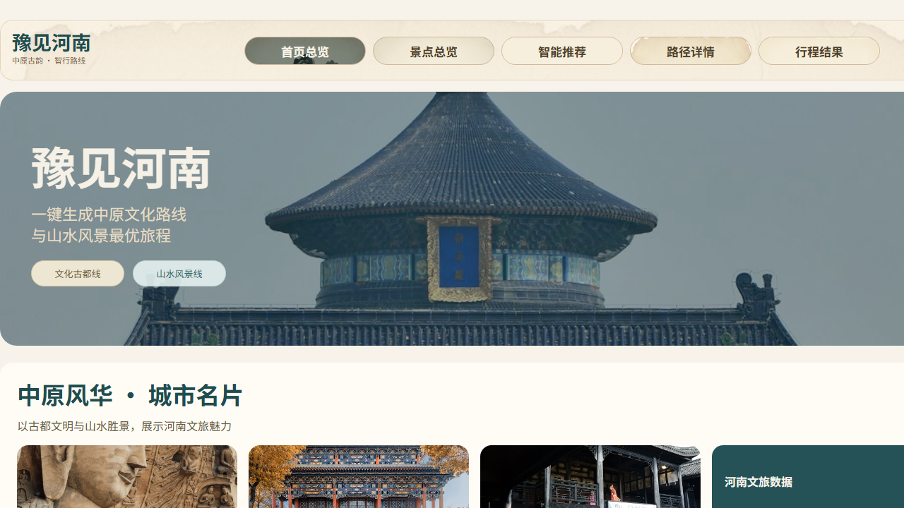

# 豫见河南（SpotPlanningSystem）

一个面向课程演示的河南旅游智能规划前端项目，围绕“选点 -> 推荐 -> 路径 -> 行程输出”构建完整体验链路。

## 项目亮点

- 五页完整业务链路：首页总览、景点总览、智能推荐、路径详情、行程结果
- 前端本地 Mock 数据驱动，开箱即可演示
- 以最短路径思路组织推荐流程，强调可解释与可视化展示
- 中国风视觉主题，适合课程汇报与产品演示

## 技术栈

- Vue 3
- TypeScript
- Vite
- Vue Router

## 页面说明

- `/home`：首页总览，展示项目主题与核心城市卡片
- `/spots`：景点总览，支持按城市/主题筛选并加入行程
- `/recommend`：智能推荐，选择起点/终点/必经点并生成链路
- `/route`：路径详情，展示景点路径与分段里程/时长/费用
- `/result`：行程结果，导出行程文案并支持分享

## 快速开始

```bash
cd frontend
npm install
npm run dev
```

默认访问：`http://localhost:5173`

## 构建与预览

```bash
cd frontend
npm run build
npm run preview
```

## 项目结构

```text
SpotPlanningSystem/
├─ frontend/                 # Vue 前端工程
│  ├─ src/
│  │  ├─ components/         # 公共组件（含顶部导航）
│  │  ├─ views/              # 五个业务页面
│  │  ├─ router.ts           # 路由配置
│  │  └─ style.css           # 全局样式
│  ├─ public/images/         # 静态图片资源
│  └─ package.json
├─ docs/                     # 设计文档与实现计划
└─ README.md
```

## 项目截图

> 首页截图（本地运行后自动采集）



## 仓库地址

- GitHub: https://github.com/ATCBK/SpotPlanningSystem
